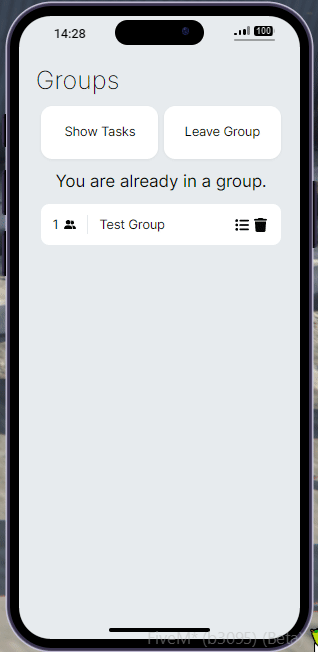

# slrn_groups


A group app for [lb-phone](https://lbphone.com/) the provides `qb-phone` compatible exports. This should work with most resources that expect a `qb-phone` style group.

**QBOX/QB/ESX/ND/OX supported with bridge**

# Preview

Light Mode             |  Dark Mode
:-------------------------:|:-------------------------:
  |  


# Installation
Download the [release version](https://github.com/solareon/slrn_groups/releases) and copy to your server.

# Customizing and building from source
Download the latest commit and navigate to the ui folder
```bash copy
pnpm i
```
Then to preview the UI. You can also switch the UI path in the app registration (switch the commented lines) and then the game will display the preview running from vite.
```bash copy
pnpm start
```
Or to build for production
```bash copy
pnpm build
```

# Support
- [Discord](https://discord.gg/TZFBBHvG6E)

# Credits
- [FjamZoo](https://github.com/FjamZoo) for rewriting groups layer
- [MaxReinold](https://github.com/MaxReinold) for making a slick UI
- [RijayJH](https://github.com/RijayJH/rj_groups-for-lb_phone) for original idea
- [overextended](https://github.com/overextended) for ox_lib

# Dependencies
- [ox_lib](https://github.com/overextended/ox_lib)

# Exports (server side only)

Both `exports.slrn_groups` and `exports['qb-phone']` are supported.


# Utility Exports

## NotifyGroup

This export is used to notify the entire group about specific objectives or events. These are typically ox_lib notifications

### PARAMETERS
- groupID (string): The identifier of the group.
- message (string): The message to be sent to the group.
- notifyType (string): The type of notification.

### USAGE
```lua copy
local group = exports.slrn_groups:GetGroupByMembers(source)
exports.slrn_groups:NotifyGroup(groupID, 'A message', 'success')
```

## pNotifyGroup

This export is used to notify the entire group about a specific objective, utilizing the built-in LB-Phone notification type.

### PARAMETERS
- group (string): The identifier of the group.
- header (string): The header/title of the notification.
- msg (string): The detailed message for the notification.

### USAGE

```lua copy
local group = exports.slrn_groups:GetGroupByMembers(source)
local header = "Garbage Job"
local message = "Head to the location marked and pick up trash!"
exports.slrn_groups:pNotifyGroup(groupID, header, msg)
```

## CreateBlipForGroup

An export to make blips that sync across group members.

Find all the FiveM related blip data you will need for this here:
https://docs.fivem.net/docs/game-references/blips/

### PARAMETERS
- group (string): The identifier of the group.
- name (string): The name/identifier for the blip.
- data (table): The data table containing blip details.

### USAGE
Do not copy paste this as the blip table might be broken only this as a reference

```lua copy
local group = exports.slrn_groups:GetGroupByMembers(src)
local blip = {
    -- NOTE YOU CAN ONLY USE ONE OF ENTITY NETID RADIUS AS THEY ALL DO THE SAME
    -- Picking none of these 3 will make it a normal blip by default
    entity = 9421, -- Use this if you have an entity spawned server side
    netId = 9421, -- Use this if you have a entity server side and you have the netId
    radius = 200, -- How big do you want the radius of the blip to be

    coords = vector4(231, 244, 92, 1.41) -- Just the coords for the blip
    color = 49, -- just a red colour
    alpha = 255, -- This makes the blip kinda see through if u lower it
    sprite = 57, -- Just a circle icon,
    scale = 0.7, -- How big do u want the blip to be?
    label = "Garbage Route", -- The label for the blip

    -- Route stuff --
    route = true, -- Will set a route for the job (Note a route is not a waypoint they cant remove it)
    routeColor = 49, -- just a red to finish off the routeColor
}
exports.slrn_groups:CreateBlipForGroup(group, "Garbage", blip)
```

## RemoveBlipForGroup

An export to remove blips across all group members

### PARAMETERS
- group (string): The identifier of the group.
- name (string): The name/identifier for the blip to be removed.

### USAGE

```lua copy
local group = exports['qb-phone']:GetGroupByMembers(src)
exports.slrn_groups:RemoveBlipForGroup(group, "Garbage")
```

## GetGroupByMembers

An export to get the players current group. If the player has no group it will return nil.

### PARAMETERS
- src (number): The source ID of the player.

### USAGE
```lua copy
local group = exports.slrn_groups:GetGroupByMembers(src)
print(group) -- Will either print the group ID or print nil.
```

## getGroupMembers

An export to get all the group members source ID

### PARAMETERS
- group (string): The identifier of the group.

### USAGE
```lua copy
local group = exports.slrn_groups:GetGroupByMembers(src)
local members = exports.slrn_groups:getGroupMembers(groupID)
print(json.encode(members)) -- Will print the table for the group members
```

## getGroupSize

An export to ge the current group size.\
This can be used if u want players to be a specific number to start a job.

### PARAMETERS
- group (string): The identifier of the group.

### USAGE
```lua copy
local group = exports.slrn_groups:GetGroupByMembers(src)
local size = exports.slrn_groups:getGroupSize(groupID)
print(size) -- Will print how many people are in the group
```

## GetGroupLeader
An export to get the current groups leader.\
This can be used to make sure only the group leader can start a job.

### PARAMETERS
- group (string): The identifier of the group.

### USAGE
```lua copy
local group = exports.slrn_groups:GetGroupByMembers(src)
local leader = exports.slrn_groups:GetGroupLeader(group)
print(leader) -- Will print the group leader source ID
```

## DestroyGroup

An export to destroy a group.

### PARAMETERS
- group (string): The identifier of the group.

### USAGE
```lua copy
local group = exports.slrn_groups:GetGroupByMembers(src)
exports.slrn_groups:DestroyGroup(groupID)
```

## isGroupLeader

An export to check if a player is the group leader

### PARAMETERS
- src (number): The source ID of the player.
- group (string): The identifier of the group.

### USAGE
```lua copy
local group = exports.slrn_groups:GetGroupByMembers(src)
local leader = exports.slrn_groups:isGroupLeader(src, group)
print(leader) -- Will print true if the source ID is the group leader
```

## isGroupTemp

An export to return if a group was created temporarily

### PARAMETERS
- group (string): The identifier of the group.

### USAGE
```lua copy
exports.slrn_groups:isGroupTemp(groupID)
```

## CreateGroup

An export to create a group by a calling resource

### PARAMETERS
- src (number): The identifier of the player source.
- name (string): The group name
- password (string): The group password (optional)

### RETURNS
- groupId (number): id of the group for later use

### USAGE
```lua copy
exports.slrn_groups:CreateGroup(src, name, password)
```

# Job Status

All exports used to modify or get the group current job statuses, you need to use this to AVOID groups doing 2 jobs at the same time etc.

## setJobStatus

An export to set the groups job to something specific.

### PARAMETERS
- group (string): The identifier of the group.
- status (string): The name/identifier of the job status.
- stages (table): A table containing stages for the job.

### USAGE
```lua copy
local group = exports.slrn_groups:GetGroupByMembers(src)
local Stages = {
    [1] = {name = "Head to the area located on your GPS", isDone = false , id = 1},
    [2] = {name = "Find the vehicle I emailed you!", isDone = false , id = 2},
    [3] = {name = "Head to the scrapping location marked on your GPS!", isDone = false , id = 3},
    [4] = {name = "Dissasemble the vehicle for parts!", isDone = false , id = 4},
    [5] = {name = "Break down the rest of the car to get rid of the evidence!", isDone = false , id = 4},
    [6] = {name = "Get out of there before you get seen!", isDone = false , id = 5},
}
exports.slrn_groups:setJobStatus(group, status, stages)
```

## getJobStatus

An export to get the current job the group is doing

### PARAMETERS
- group (string): The identifier of the group.

### USAGE
```lua copy
local group = exports.slrn_groups:GetGroupByMembers(src)
local job = exports.slrn_groups:getJobStatus(group)
print(job) -- If you followed above step it will print Chop Shop
```

## resetJobStatus

An export to reset the current groups job status to be WAITING.

### PARAMETERS
- group (string): The identifier of the group.

### USAGE
```lua copy
local group = exports.slrn_groups:GetGroupByMembers(src)
exports.slrn_groups:resetJobStatus(group)
```

# Copyright

Copyright © 2024 Solareon <https://github.com/solareon>

This program is free software: you can redistribute it and/or modify it under the terms of the GNU General Public License as published by the Free Software Foundation, either version 3 of the License, or (at your option) any later version.

This program is distributed in the hope that it will be useful, but WITHOUT ANY WARRANTY; without even the implied warranty of MERCHANTABILITY or FITNESS FOR A PARTICULAR PURPOSE. See the GNU General Public License for more details.

You should have received a copy of the GNU General Public License along with this program. If not, see <https://www.gnu.org/licenses/>.
